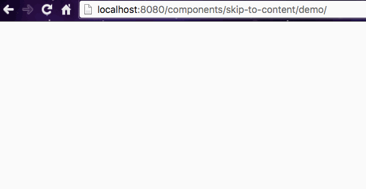

# &lt;skip-to-content&gt;

> <⬇️/> A Polymer element for Skip to Content.



## Live Demo

[Check it live!](http://afonsopacifer.github.io/skip-to-content/)

## Install

Install the component using [Bower](http://bower.io/):

```sh
$ bower install skip-to-content --save
```

## Usage

1. Import Web Components' polyfill:

```html
<script src="bower_components/webcomponentsjs/webcomponents-lite.min.js"></script>
```

2. Import Custom Element:

```html
<link rel="import" href="bower_components/skip-to-content/skip-to-content.html">
```

3. Start using it!

```html
<skip-to-content skipTo="#main" color="#e00571"></skip-to-content>
```

## Attributes

Attribute  | Type        | Default             | Description
---        | ---         | ---                 | ---
`skipTo`   | *String*    | `#main`    | Destination ID.
`color` | *String*   | `#000`             | The background color.

## Style

Style the element with CSS as you would a normal DOM element.

```CSS
.skip-to-content {

}
```

## Browser Support

Using the [webcomponents.js](https://github.com/WebComponents/webcomponentsjs)

 |  |  |  | 
--- | --- | --- | --- | --- |
11+ | Latest ✔ | Latest ✔ | Latest ✔ | Latest ✔

## Development

1. Install [Bower](http://bower.io/) & [Polymer-CLI](https://www.polymer-project.org/1.0/docs/tools/polymer-cli):

```sh
$ [sudo] npm install -g bower polymer-cli
```

2. Install local dependencies:

```sh
$ bower install
```

3. Start the development server on http://localhost:8080/:

```sh
$ polyserve
```

**View docs:**<br>
http://localhost:8080/components/skip-to-content/

**View demo:**<br>
http://localhost:8080/components/skip-to-content/demo/

## Versioning

To keep better organization of releases we follow the [Semantic Versioning 2.0.0](http://semver.org/) guidelines.

## Contributing
Find on our [issues](https://github.com/afonsopacifer/skip-to-content/issues/) the next steps of the project ;)
<br>
Want to contribute? [Follow these recommendations](https://github.com/afonsopacifer/skip-to-content/blob/master/CONTRIBUTING.md).

## History
See [Releases](https://github.com/afonsopacifer/skip-to-content/releases) for detailed changelog.

## License
[MIT License](https://github.com/afonsopacifer/skip-to-content/blob/master/LICENSE.md) © [Afonso Pacifer](http://afonsopacifer.com/)
